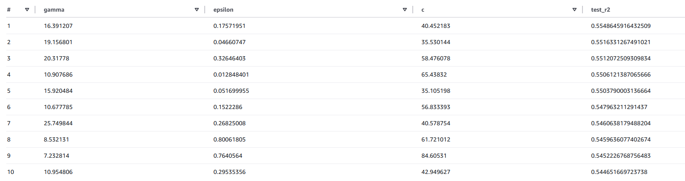

# AWS Diabetes ETL

Lightweight ETL for the SVR fitting on the diabetes dataset designed to run on an EC2 instance, push structured JSON into S3, and expose the facts/hyperparameters via Athena.

## Architecture

1. EC2 runs the `files/scripts` Python code and ships the generated result JSON to an S3 bucket. The code fits the diabetes dataset from sklearn with randomly generated hyperparameter $\gamma,C,\epsilon$ values. Executions are dictated by a cronjob.
2. The `queries/` SQL defines external tables (`data`, `hyperparams`, `predict`) that directly read those objects.
3. `final_query.sql` joins the tables, evaluates each model (test R²), and orders them by fit quality.

## Data model

- The core dataset (`data`) contains patient features split into train/test groups plus the ground truth (`y_true`).
- `hyperparams` stores a single SVR configuration with `gamma`, `C`, and `epsilon` per run.
- `predict` records predictions (`y_pred`) for every data point and links back to the hyperparameter row by `hyper_id`.

## Repository layout

- `assets/` – reference diagrams embedded above.
- `files/` – supporting shell scripts, generated data, and Python tooling.
- `files/diabetes_data/` – exported `diabetes_data.json` (newline-delimited JSON) created from scikit-learn’s dataset.
- `files/scripts/` – Python helpers described below.
- `queries/` – sql files for external table creation plus the R² evaluation query.
- `results/` – example outputs from previous pipeline runs (S3-style JSON and CSV final result).
- `crontab.txt` – cron entry to run `files/runpipeline.sh` every minute (used for automated EC2 scheduling).

## Setup & execution

1. Install dependencies inside EC2: `files/ec2_setup.sh` installs system tools and `numpy`/`scikit-learn` via `pip`.
2. Generate the local dataset: from `files/scripts`, run `python create_data_json.py` to dump `files/diabetes_data/diabetes_data.json`.
3. Launch the training pipeline: `files/runpipeline.sh` calls `files/scripts/run.py`, copies the `<timestamp>_hyper.json` and `<timestamp>_fact.json` files to their respective S3 prefixes, and deletes the temporary JSONs afterward.
4. Optionally, schedule `runpipeline.sh` via the cronjob defined in `crontab.txt` so the job runs periodically on EC2.

## Script details

- `files/scripts/create_data_json.py` – splits the scikit-learn diabetes dataset into train/test, tags each record with `is_train`, and writes a newline-delimited JSON file with patient features plus `y_true`.
- `files/scripts/run.py` – draws random hyperparameters within the ranges defined in `files/scripts/config.py`, trains an SVR model, writes the hyperparameter JSON, and streams predictions for every point into the fact JSON.
- `files/scripts/config.py` – central location for the SVR search ranges, random state, and fold/test settings used by both data generation and training scripts.
- `files/runpipeline.sh` – orchestrates the run (calls `run.py`), uploads both artifact types to S3 (`hyper/` and `fact/` prefixes), and removes the local JSON files.
- `files/ec2_setup.sh` – bootstraps a Fedora/CentOS-compatible EC2 host with Python tooling, compiler toolchain, and cronie for scheduling.

## SQL artifacts

- `queries/create_data_table.sql`, `create_hyperparams_table.sql`, `create_predict_table.sql` – create external tables on `database-1` with JSON SerDe pointing at the S3 prefixes.
- `queries/final_query.sql` – window functions compute SSE/variance per `hyper_id`, join with `hyperparams`, and sort hyperparameter combinations by measured R² for non-training rows.

## TODO
- Add IAM roles/permissions